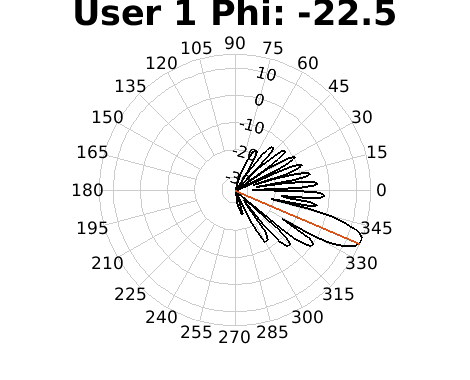
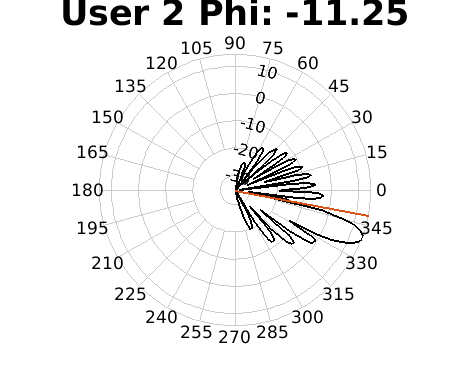
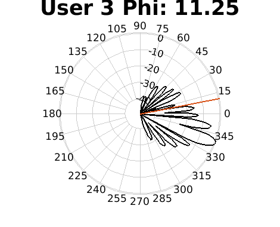
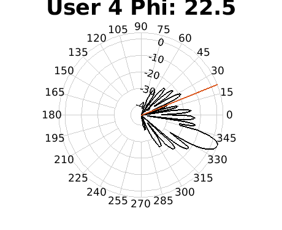

## Abstract
The proliferation of bandwidth-hungry applications and the push towards network densification is saturating the sub-6GHz bands, resulting in increased interest in the mmWave band. Given the unique communication characteristics of this band, i.e. requirement of line of sight, asymmetric antenna configurations at the transmitter/receiver, densification of users, and short propagation distance, two key downlink capabilities become important: directional beamforming and concurrent transmissions through Multi-User MIMO (MU-MIMO) operation. We present an algorithmic framework that optimally allocates BS antenna elements to users while considering individual traffic demands. This allows non-uniform antenna distributions per user, but also grouping of antennas of the transmitter array into non-regular geometries to meet individual QoS. Our approach achieves this by: (i) improving the performance of classical LCMV beamforming through a genetic algorithm, and (ii) scheduling users in time to minimize disruption. The performance is validated using real Internet applications traces and a cross-layer simulation framework spanning PHY-application layers in the band. Our approach shows an SINR improvement of 2-5dB and 10-20dB for scattered and compact user locations, respectively, compared to conventional LCMV. Finally, the network stress tests reveal that a joint scheduling and PHY keeps the number of packets that violate the QoS demands at a minimum [1].

## Project overview
This project contains the base code for the cross-layer scheduler for MU-MIMO 5G presented by the Genesys lab, in collaboration with the Mathworks inc. The technical details of the proposed mechanism and the assumptions made can be found on the technical paper submitted to IEEE Transactions on Wireless Communications [1].

We envision a 5G downlink communication (Base Station to users), where a single Base Station receives upper layer Internet traffic, organized by application type, and schedules PHY packets to users in a TDMA-fashion employing MU-MIMO capabilities. The PHY-layer is constrained by two factors: the number of available mmWave antennas and the interconnectivity between RF-chains and antenna elements. 

To maximize the PHY resource utilization in MU-MIMO, we propose HELB or Heuristically enhanced LCMV Beamformer. HELB utilizes Genetic Algorithms to allocate antennas per users, leveraging he sub-array flexibility offered by the antenna patch. HELB operates under the basic antenna principle that a wider antenna separation incurs in higher number of secundary lobes. HELB intelligently uses the knowledge of the clusters in the mmWave channel that each users see to efficiently locate power maximums towards intended directions while minimizing the power in the clusters of other user's channels. Thus, maximizing receive power and minimizing interference (SINR). For instance, in a simplistic scenario where users perceive only one cluster in the wireless channel, with 4 users distributed at fixed locations, HELB allocates a maximum towards the intended user (user 1) whereas it allocates nulls for the single paths of other users (users 2, 3 and 4):

<p align="middle">




</p>

The wireless communications is validated using PHY layer that is standards-compliant with the 802.11ad/ay standard. Both, the 5G and the 802.11ad/ay, can operate in TDMA mode for downlink. The upper-layer bits are encoded and modulated and incorporated into the PHY-frame, along with the respective headers. We use a Clustered Delay Line (CDL) channel model, as specified in the 3GPP for Link- and PHY-layer simulation.

Real Internet traces are used to generate the upper-layer bits. The traces allow for the characterization of number of flows, flow duration and bits per flow per applications. The applications are divided by the estipulated 5G requirements in terms of Packet Error Rate (%) and latency (ms). For instance, real time gaming requires 50ms latency while non-conversational video requires 300ms. This information is used by the upper layer scheduler, along with the aforementioned PHY-layer information, to schedule packets over time to maximize the number of flows that meet the application requirements.

All in all, this project covers:

1. Characterization of upper-layer traffic using real Internet traces.
2. Development of an upper-layer scheduler based on required deadlines (ms) per packet per application using a EDF (Earliest Deadline First) policy.
3. Development of an evolutionary beamforming procedure called HELB, which uses Genetic Algorithm to distribute efficiently antennas per users in a resource constrained PHY-layer framework. HELB proves to provide higher data rates in a MU-MIMO scenario with flexible sub-array at the BS.
4. Network saturation considering both, the upper-layer scheduler and HELB, proving that the number of flows that violate the application requirements is kept at a minimum. The simulator is organized as a Discrete Event Simulator (DES), having timeslots as events.

## Project hierarchy

The main code is confined within the following functions:

- **main.m**: This is the main runnable in the Project. The code is built as a Discrete Event Simulator (DES) that emulates a 5G Base Station (BS) operating in the millimeter wave band. The DES divides its sequential operation into:
	- configures upper-layer traffic and PHY-layer constrains.
	- iterates in a per-slot fashion and selects the appropiate flows per user and users per slot.
	- calls the beamformer to compute the digital weights at the BS. 
	- configures the radiation pattern using such weights, encapsulates the information into the frame and sends it over the 5G mmWave wireless channel. 
	- receives the packet, decodes the bits and evaluates the perceived SINR and BER.
- **main_plotting.m**: Plots results from the DES after running the **main.m** function.
- **main_runnable.m**: This script is conceived as a developing experiment script where the user configures the experiments. So far, 9 experiments are configured, each of them with clearly differentiated goals such as finding the evolution of the fitness value over time, evaluating the directivities achieved when varying the array dimmensions or the user location in space, evaluating the effectivity of the proposed crosslayer scheduler when having dissimilar traffic arrivals, etc.

The main functions extend from other functions, confined into three other folders depending upon their application:

- */code_systems/*: Contains the functions required by the DES.
- */code_beamforming/*: Contains the functions required for the beamforming.
- */code_wirelessEmulation/*: Contains the functions required to emulate the 5G wireless channel (3GPP 5G CDL).

Other folders of interest are:

- */data/*: Contains the configuration files and pre-stored data for the simulation. The pre-stored data is in the form of so-called tables that store required information to fasten the simulator execution. For instance, the table **TrafficDataSetUPC.mat** encapsulates the parsed data traffic from various applications, which emulates the upper-layer Internet traffic. Another example is the **MCSPERTable.mat**, which relates the statistical PER obtained with the MCS used as a function of the perceived SINR. The simulation can be fully configured using the following files:
    + metaproblem\_test.dat: Configures the communication environment. For instance, the dimensions of the sub-array at the BS, the number of users, the spatial distribution of users, the upper-layer traffic, etcetera.
    + config\_test.dat: Mainly configures the Genetic Algorithm solver embedded within the HELB. For instance, the population size, the number of genes, the maximum number of generations or the tolerance for improvement.
- */results/*: Meant to store final results in the form of *.eps/fig/png/jpg/pdf*.
- */temp/*: Meant to store preliminary results after the execution of **main.m** or **main_runnable.m**. It serves as an intermediate step between the simulation and actual plotting. The results are in the form of *.mat*
- */UTILITIES/*: Meant to encompass any external functions that are used through the execution.
- */old/*: Any deprecated script or function shall be allocated in this folder.

## Testing folder

Test shall be built and stored in the Testing folder designated as */TESTING/*. So far, the project includes some tests to evaluate the performance of HELB and the proposed scheduler, but it is intended for continuous developing.

For beginners, the script **test_myfirstScript.m** gives a good overview of the beamforming code and how HELB achieves better performance than conventional and LCMV beamformers. Let's cover the basic functionality behind it to get a better understanding of the code structure.

First, we clean up our environment and include the required folders into our path:
```Matlab
clear; close all; clc;
addpath('../UTILITIES','-end');  % Add utilities folder at the end of search path
addpath('../code-systems','-end');  % Add system's folder at the end of search path
addpath('../code-beamforming','-end');  % Add beamforming folder at the end of search path
addpath('../code-wirelessEmulation','-end');  % Add channel folder at the end of search path
addpath('../data','-end');  % Add data folder at the end of search path
```

Load the basic configuration from the .dat files in the */data/* directory.
```Matlab
%% Basic comms parameters
problem = o_read_input_problem('metaproblem_test.dat');
conf = o_read_config('config_test.dat');
```

For better dynamism, overwrite the configuration parameters from the default configurations. The idea is to keep most of them and vary just a few in each test.
```Matlab
%% Input parameters
problem.N_Antennas   = 8.^2; % Number of antennas
problem.nUsers       = 4;  % Number of users
candSet              = (1:1:problem.nUsers);  % Users to be considered for antenna alloc. ALL
conf.detLocation     = false;  % true to use preconfigured locations, false for random
conf.useCaseLocation = false;  % if detLocation is true, retrieve pre-stored locations
conf.verbosity       = 1;  % For debugging purposes
```

Configure the TX antenna array by creating a conformal array handle. In addition, retrieve the element locations, used by the GA within HELB.
```Matlab
%% Adjust antenna parameters and create Antenna Array
problem.NxPatch = floor(sqrt(problem.N_Antennas));
problem.NyPatch = floor(problem.N_Antennas./problem.NxPatch);
problem.NzPatch = problem.NxPatch;
problem.handle_Ant = phased.CosineAntennaElement('FrequencyRange',...
                        [problem.freq-(problem.Bw/2) problem.freq+(problem.Bw/2)],...
                        'CosinePower',[1.5 2.5]);
problem.dz = problem.dy;
handle_ConformalArray = phased.URA([problem.NyPatch,problem.NzPatch],...
                        'Lattice','Rectangular','Element',problem.handle_Ant,...
                        'ElementSpacing',[problem.dy,problem.dz]);
problem.possible_locations = handle_ConformalArray.getElementPosition;
elementPos = problem.possible_locations./problem.lambda;
```

Locate users in space and assign preliminary traffic.
```Matlab
% Basic configuration - Location of users
[problem,~,~] = f_configuration(conf,problem);
```

For each user, allocate the same number of antennas randomly within the given set in the array. Then, run the conventional and LCMV beamformers and retrieve the weights.
```Matlab
%% First, compute the beamforming weights (CBF and LCMV) with fixed antenna allocation
for id = 1:problem.nUsers
    % Randomly and equally assign antennas to users
    antennaSelected = randsample(availableAnt,problem.N_Antennas/length(candSet));
    availableAnt = setdiff(availableAnt,antennaSelected);
    
    % Retrieve antenna locations
    elementPos1 = elementPos(:,antennaSelected);
    problem.IDUserAssigned = id;
    
    % Retrieve users locations in space
    angles = [-problem.phiUsers ; -problem.thetaUsers];
    
    % Preconfigure beamformers
    sv = steervec(elementPos1,angles);
    Sn = eye(length(antennaSelected));
    resp = zeros(problem.nUsers,1);
    resp(problem.IDUserAssigned) = db2pow(33);
    
    % Call LCMV beamformer
    W_LCMV1 = lcmvweights(sv,resp,Sn);
    W_LCMV(id,antennaSelected) = W_LCMV1.';  % Create global arrray for weights
    
    % Call Conventional (CBF) beamformer
    W2 = cbfweights(elementPos1,angles(:,problem.IDUserAssigned));  % conventional beamformer
    W_CBF(id,antennaSelected) = W2.';  % Create global arrray for weights
    
    % Normalize weigths
    W_LCMV(id,:) = (1/sqrt(W_LCMV(id,:)*W_LCMV(id,:)'))*W_LCMV(id,:);
    W_CBF(id,:) = (1/sqrt(W_CBF(id,:)*W_CBF(id,:)'))*W_CBF(id,:);
end
```

Compute weights using the proposed HELB, whose solver is embedded in the function **CBG_solveit.m**.
```Matlab
%% Second, compute the weights using the proposed HELB mechanism
problem.MaxObjF = ones(1,length(candSet));
problem.MinObjF = ones(1,length(candSet));
if conf.MinObjFIsSNR;     problem.MinObjF = 2.^problem.MinObjF - 1;
end
problem.initialW = W_LCMV;
[sol_found,W_HEU,handle_ConformalArray,PRx,I,bestScores] = CBG_solveit(problem,conf,candSet);

% Normalize weights
for id = 1:problem.nUsers; W_HEU(id,:) = (1/sqrt(W_HEU(id,:)*W_HEU(id,:)'))*W_HEU(id,:); end
```

Finally, retrieve and parse the results. Mainly, compute the Directivities achieved towards intended and non-intended users per each user configuration. Lastly, compute the achieved overall capacity, accounting for the generated interference.

```Matlab
%% Results

% Parse output results
[~,~,Cap_LCMV_lin,~]  = f_BF_results(W_LCMV,handle_ConformalArray,candSet,problem,conf,false);
[~,~,Cap_CBF_lin,~]  = f_BF_results(W_CBF,handle_ConformalArray,candSet,problem,conf,false);
[~,~,Cap_HEU_lin,~]  = f_BF_results(W_HEU,handle_ConformalArray,candSet,problem,conf,false);

% Parse output
Cap_LCMV_tot = mean(Cap_LCMV_lin);
Cap_CBF_tot = mean(Cap_CBF_lin);
Cap_HEU_tot = mean(Cap_HEU_lin);
fprintf('LCMV: %.3f\tCBF: %.3f\tHELB: %.3f\n',Cap_LCMV_tot,Cap_CBF_tot,Cap_HEU_tot);

% Plot assignation
px = problem.possible_locations(3,:);  % Antenna allocation on x-axis
py = problem.possible_locations(2,:);  % Antenna allocation on y-axis
pz = problem.possible_locations(1,:);  % Antenna allocation on z-axis
patch = o_getPatch(problem.NxPatch,problem.NyPatch,px,py);
% Assignation by LCMV
arrays = o_getArrays(problem.nUsers,W_LCMV,px,py,pz);
o_plot_feasible_comb(problem,conf,patch,arrays);
% Assignation by LCMV+HEU
arrays = o_getArrays(problem.nUsers,W_HEU,px,py,pz);
o_plot_feasible_comb(problem,conf,patch,arrays);
```

## Required Software

The code is entirely Matlab based and requires Release R2018a or older to work properly. In addition, the code requires specific functions that ship within particular toolboxes:

- **Optimization Toolbox**: Allowed to configure the Heuristic stage in HELB with Genetic Algorithms, specifying genes, generations, elite count, mutation and crossover.
- **Communication System Toolbox**: Used to model the channel impairments, small and large scale fading parameters and AWGN in the wireless communication link.
- **5G Plugin** (Release R2018a) or **5G Toolbox** (Release R2018b): Offered Clustered Delay Line (CDL) channel models to account for the clustered feature in the mmWave wireless 5G channel.
- **WLAN System Toolbox**: The PHY frames were confectioned following the 802.11ad standard's guidelines, accounting for required headers and payload fields with realistic properties such as MCS, field sizes, etc.
- **Phased Array Toolbox**: Used to simulate the antenna radiation pattern with user specified antenna locations that match irregular antenna patches, containing antennas operating in the mmWave band.

## Contact

For more information about our code and project, please don't hesitate to contact us by email. We'll be happy to assist you and answer any question you may have.

Carlos Bocanegra Guerra  
PhD Candidate  
Electrical and Computer Engineering (EECE)  
Northeastern University  
bocanegrac@coe.neu.edu

Santiago Rodrigo  
PhD Student  
Electronic Engineering Department  
Polytechnic University of Catalonia (UPC), Barcelona, Spain  
santirodrigom@gmail.com

Zhengnan Li  
PhD Student
Electrical and Computer Engineering (EECE)  
Northeastern University  
li.zhengn@husky.neu.edu

Kaushik R. Chowdhury  
Associate Professor  
Electrical and Computer Engineering (EECE)  
Northeastern University  
krc@ece.neu.edu

## Acknowledgements

This work is supported in part by DARPA under the Young Faculty Award grant N66001-17-1-4042 and by MathWorks under the Development-Collaboration Research Grant. We are grateful to Dr. Tom Rondeau, program manager at DARPA, and Mike McLernon from MathWorks for their insightful comments and suggestions that significantly improved the quality of the work.


## References

[1] C. Bocanegra, S. Rodrigo, Z. Li, A. Cabellos, E. Alarcon, K. R. Chowdhury, "Qos-aware Antenna Grouping and Cross-layer Scheduling for mmWave Massive MU-MIMO", submitted to IEEE Transactions on Wireless Communications, January 2019.